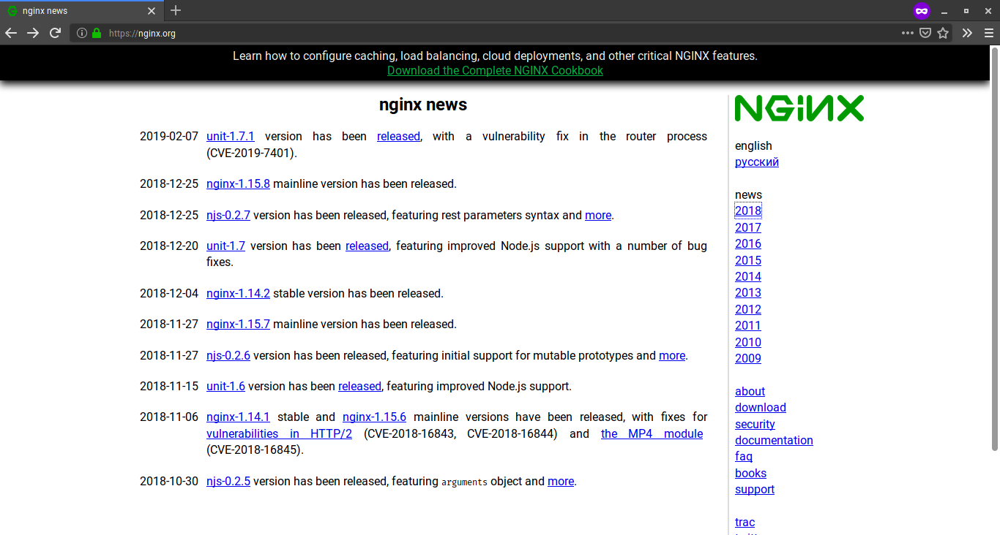
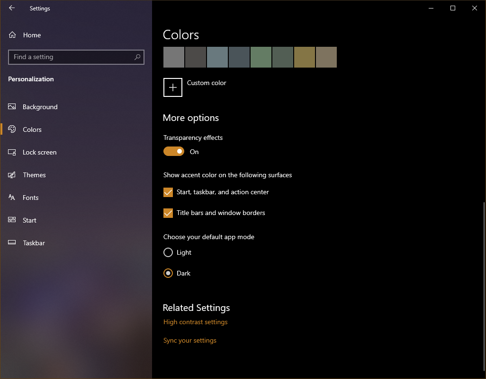
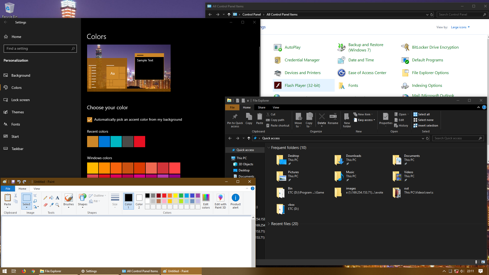
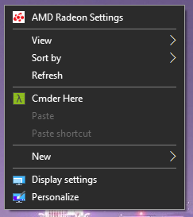
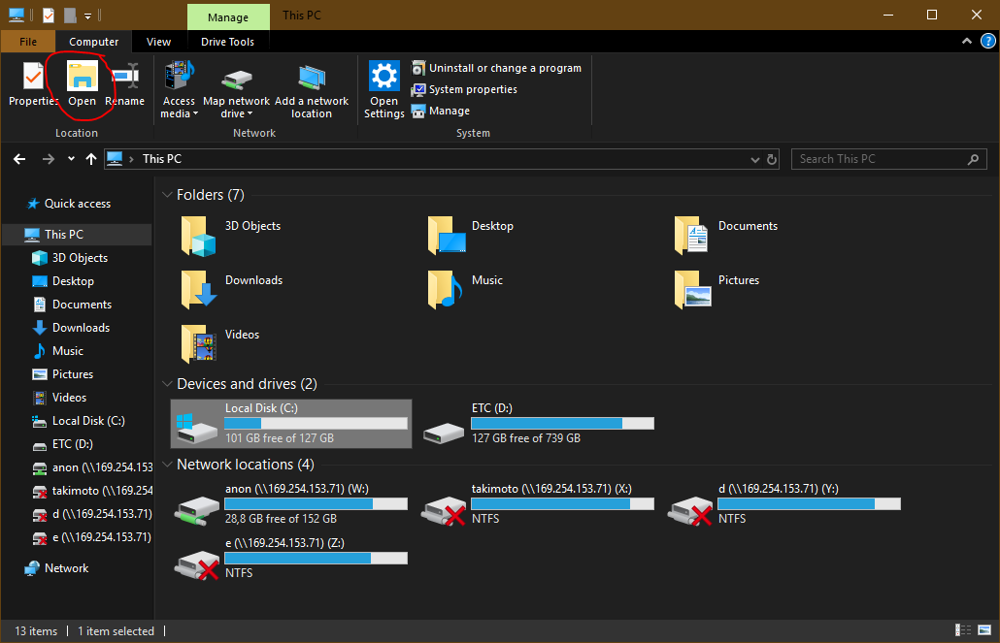
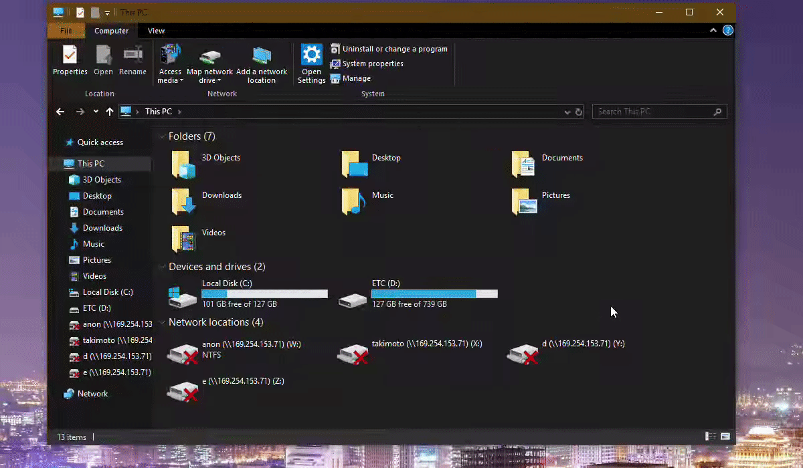
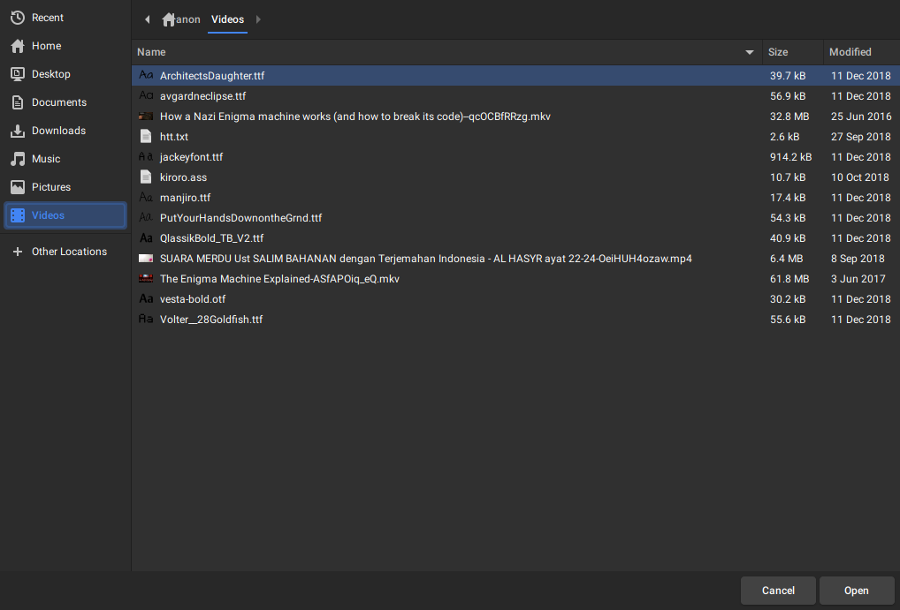
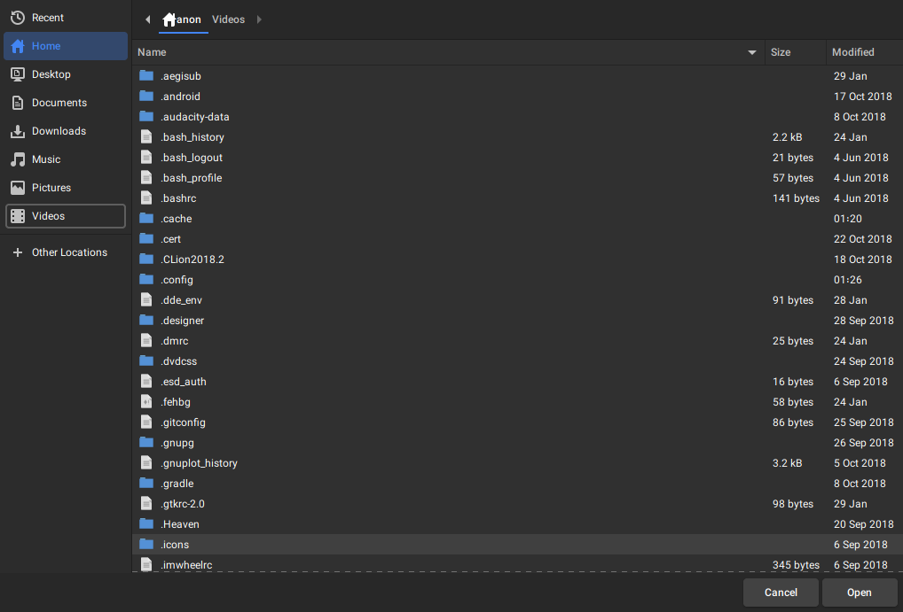

# About Author
```
Name    : Deddy Aditya Pramana
NRP     : 05111640000069
Class   : Human-Computer Interaction A
```


# Assignment 0

## Table of Contents
* [nginx's Website](#nginxs-website)
    * [What I considered bad...](#what-i-considered-bad)
    * [Suggestions](#suggestions)
* [Windows Dark Mode](#windows-dark-mode)
    * [Why I think this bad...](#why-i-think-this-bad)
    * [What should Microsoft improve...](#what-should-microsoft-improve)
* [GTK+ File Chooser](#gtk-file-chooser)
    * [How bad is it?](#how-bad-is-it)
    * [What should GTK developer do?](#what-should-gtk-developer-do)

## nginx's Website

nginx is a very well known web server, proxy-server and load balancer. Many people using nginx as web server because it's free, rich on feature and offers very good performance than another web server.

### What I considered bad...

* **Very Basic UI**



The first impression I have from this site is _"is this the nginx's official site?"_ Well, I know that this is one of the "Free and Open Source Software" but a lot of FOSS programs has a better homepage than this website. Just take a look at [Blender's website](https://www.blender.org/) as comparison. 

The site just filled with only text without any overview and illustration about the product. There is no attractive button on the main site to direct the user to the download page. The color of the page looks a little bit boring for me. 

* **Non-responsive design**


Another problem that suffers this site is the site doesn't have responsive-design. It looks awful if we open on mobile devices like smartphone. Seriously, satire website like bettermotherfuckingwebsite.com fits on mobile screen perfectly.

* **Weird location for site navigation**

The position and layout of navbar is a little bit unusual. I spent 5 minutes looking for download page for nginx when I visited this site first time because of this. The navigation bar also looks different when we open the different page like About or Download.

### Suggestions

* Give overview and illustration about the product and make it as a central of attaction as a home page. Also provide the attractive 'Download' button. It would ease the visitors because most of them just looking the way to download the software.
* Make the site responsive. You can use the frontend framework like Bootstrap or implement your own if you think that bootstrap is too bloated. At least the mobile users can view the site without panning and zooming through the site.
* Redesign the navigation sidebar. Maybe put things like "News", "Download", "About" and other vital pages on the navbar on top of page and make it static through scrolling, and the subpages of the current opened pages on the left sidebar.

## Windows Dark Mode

Windows 10 provides 'Dark Mode' since the latest update. This is one feature that I want to see in Windows for a long time. But the realization itself is far from the 'Dark Mode' that I expected.



### Why I think this bad...

* **Not completely affects all windows apps**



When I tried this feature, I'm really disappointed with this. Not all Windows built-in app affected by this dark theme implementation. UWP apps like Windows newer Settings, Microsoft Store and Groove Music are affected with Dark Theme. Windows File Explorer also get the dark theme. Legacy Control Panel partially affected with dark theme. Other Windows built-in apps like Microsoft Paint and Windows Task Manager doesn't affected with the dark theme. I feel that Windows 'Dark Mode' is very inconsistent across the apps even though it's between Windows's built-in apps. Surprisingly, some user-mod dark theme implementations are batter than windows' one because they also support implementing dark theme to third-party apps.

* **Incompatible Icons**



Some application still provides icons that incompatible with 'Dark Mode'. It's not a big issue but from aesthetic standpoint, it's sometimes infuriating.



Surprisingly, not only third party apps who suffers this problem. Windows File Explorer also suffers this kind of problem.

* **Immature Implementation**



I don't know why but the implementation of 'Dark Mode' on Windows File Explorer itself feels immature. When I open the special directory like `C:\Windows\Fonts`, the dark theme on Windows File Explorer broke. It's sad that this is happened on long term stable channel too (Windows LTSC)

## What should Microsoft improve...

* Complete the implementation of current dark theme for every Windows Built-in applications before adding more features on Windows. 
* Enforce a standard for icons to support 'Dark Theme' for all application on Windows.

# GTK+ File Chooser



GTK+ File Chooser is the default file chooser for GTK+ based applications on Linux.

## How bad is it?

* **Awful default settings**



Personally, I find that GTK+ file chooser has an awful default settings. Mixing between folder and files sometimes infuriating when I need to open a folder that located far below. Showing hidden files by default is awful especially if you're on home directory where a lot of applications store dotfiles there.

* **Some useful option are hidden**

I was really confused when first time using GTK+ file chooser. Some of the file chooser options (like Show Hidden Files) are shown if I right-click a file. Some options only available if I press a keyboard shortcut (like `Ctrl+L` to edit the current address). I find this very confusing especially for the new user.

* **There is no option to change the view**

Yes, you're right. _"List View"_ is the one and only view mode that is available on GTK+ file chooser. There is no other view mode like _"Thumbnail View"_ or _"Icon View"_. It's annoying if we need to deal with pictures or videos (like choosing pictures to upload to web).

## What should GTK developer do?

* Add some important option buttons on the top-right side like enable/disable address bar editing.
* Implement other _"View Mode"_ like _"Thumbnail View"_. (This issue was already on their bug tracker, but rejected)
* Listen to your user. Sometimes what user want is different from what developer want. If user requirements aren't fulfilled, user might think to use a similar product (or software in this case) from other developer.